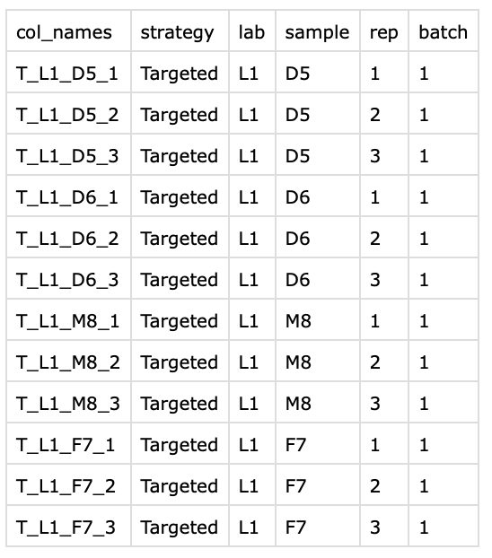

From Quantified Expression Profiles to QC Report for Metabolomics (targeted and untargeted)

.csv format of quantified expression profiles at metabolite level

!!! note 
    You can find the source code on [chinese-quartet/quartet-metqc-report](https://github.com/chinese-quartet/quartet-metqc-report.git)

## Prepare data & metadata files

### Data File
The data file provides quantitative information on Quartet samples at the metabolite level. 
1. The data file should be comma separated values (`.csv`) or tab delimited text (`.txt`) with a header in the first row.
   
2. Samples should be in the columns of the file. 
   
3. Quantitative results should be given in the form of concentrations or peak intensities and contain only numeric and positive values. 
   
4. Two columns accurately named "metabolites" and "HMDBID" are needed, which contain the name of the metabolite compound and HMDBID, respectively. If HMDBID is not available, use "NA" for missing values in the data file.
   
5. Both sample or metabolite compound names must be unique and consist of a combination of common English letters, underscores and numbers for naming purpose. Sample name should not be started with numbers. Latin/Greek letters are not supported.

More details on [https://www.metaboanalyst.ca/docs/Format.xhtml](https://www.metaboanalyst.ca/docs/Format.xhtml).

### Metadata File
The metadata file has the information of each sample in the data file. 
With columns accurately named "col_names" (names of samples, identical to their names in the columns of data file), "strategy" (Targeted or Untargeted), "lab" (the name of lab), "sample" (D5, D6, F7 and M8 for Quartet samples), "rep" (the replicates for each sample) and "batch" (the name of batch).

A screenshot of a sample metadata table is shown below.

{ width="60%" }

## Step by Step Guide

### Analyze your data on your own server

1. Pull docker container 

    More versions on [Docker Registry](https://github.com/chinese-quartet/quartet-metqc-report/pkgs/container/quartet-metqc-report)

    ```
    docker pull ghcr.io/chinese-quartet/quartet-metqc-report:v0.2.1-3cc61071
    ```

2. Run quartet-metqc-report with docker image

    Assuming that your data file is named `data.csv` and metadata file is named `metadata.csv` and all files are placed in `/your-dir` directory.

    ```
    docker run -v /your-dir:/data -it ghcr.io/chinese-quartet/quartet-metqc-report:v0.2.1-3cc61071 -d /data/data.csv -m /data/metadata.csv -o /data
    ```

3. Find your QC report in `/your-dir/multiqc_report.html`


### Analyze your data on Quartet Data Portal

As for running the QC pipeline of metabolomics data, you can:

1) go to [http://chinese-quartet.org/#/seq-flow/metqc-report-management](http://chinese-quartet.org/#/seq-flow/metqc-report-management);

2) click the upper right button named "New QC report";

3) click "Step 1: Choose Report", please choose "QC Report for Quartet Metabolomics" ;

4) click "Step 2: Upload Files (s)", please upload your data and metadata files (.csv). 

5) click "Step 3: Parameters & Submit", please fill in the blanks and submit the job.