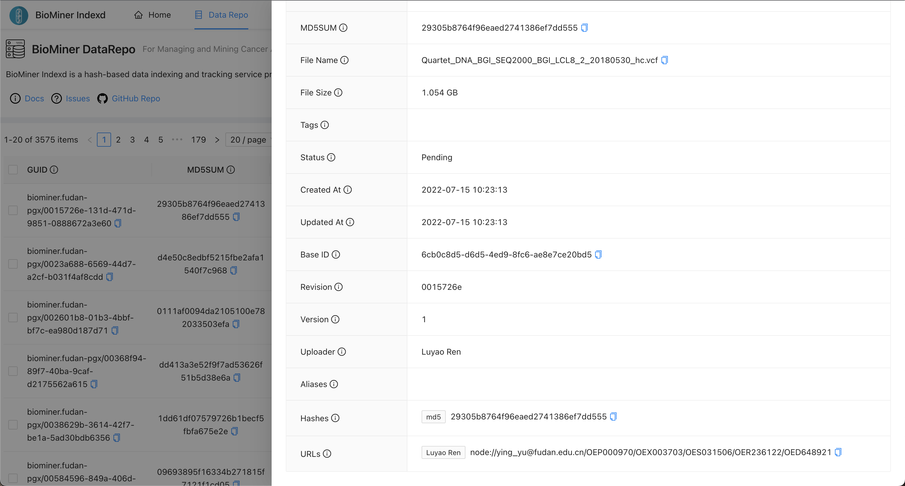

### Data Policies
The Quartet Multi-omics reference materials and raw datasets are publicly available and accessible. Researchers are encouraged to access and analyze the datasets. The recipients of the Reference Materials are highly encouraged to share their data with Fudan University through the Quartet Data Portal in order for us to improve the reference datasets and to better serve the community.

### How to download the omics data files?

- Download a metadata table from multi-omics data page.(such as genomics data in <a href="https://www.chinese-quartet.org/#/data/download/quartet-genomics" target="_blank">Multiomics Data -> Genomics Data</a>
- Get the md5sum of files which you want to download from the metadata table.
- Follow the following docs to download your expected files.

#### Download `file transfer tool - biominer-aget`
Download biominer-aget binary from [BioMiner Aget for Linux](https://www.indexd.org/biominer-aget/biominer-aget_x86-64_linux) or [BioMiner Aget for Mac](https://www.indexd.org/biominer-aget/biominer-aget_x86-64_macosx)

Copy the biominer-aget binary into /usr/bin/biominer-aget or any other directory which in PATH variable.

#### Download a data file with biominer-aget
e.g. you want to download the file with UUID `00006134-c655-4bbe-9144-0ee86da83902` or Hash (such as md5sum, sha128...) `b02ced3319ba35746e2436d67b04a42c` from the repository biominer.fudan-pgx, you can run the following command:

```bash
biominer-aget --guid biominer.fudan-pgx/00006134-c655-4bbe-9144-0ee86da83902 --output-dir ~/Downloads/ --repo gsa --chunk_size 1m --concurrency 1000

## or

biominer-aget --hash b02ced3319ba35746e2436d67b04a42c --output-dir ~/Downloads/ --repo gsa --chunk_size 1m --concurrency 1000

## NODE repo doesn't support http range, so the --chunk_size and --concurrency arguments don't work for it.

biominer-aget --hash b02ced3319ba35746e2436d67b04a42c --output-dir ~/Downloads/ --repo node
```

!!!note Please note that
    1. The `chunk_size` and `concurrency` parameters are related with the download speed. **There may be tens or hundreds of times the difference, so it's worth taking some time to find the best one.**
    
    2. The biominer-aget binary is not available for Windows.
    
    3. Not each file can be found in all these repos, so you need to specify a repo name when you downloading expected file.

```bash
$ biominer-aget --help
Biominer Aget 0.3.7
Jingcheng Yang <yjcyxky@163.com>
An Index Engine for Omics Data Files

USAGE:
    biominer-aget [FLAGS] [OPTIONS]

FLAGS:
    -D, --debug      Activate debug mode
    -h, --help       Prints help information
    -V, --version    Prints version information

OPTIONS:
    -a, --api-server <api-server>      The api server address
    -k, --chunk_size <chunk_size>      The number ofinterval length of each concurrent request [default: '50m']
    -c, --concurrency <concurrency>    The number of concurrency request [default: 10]
        --dns-timeout <dns-timeout>    DNS Timeout(seconds) of request [default: 10]
    -g, --guid <guid>                  The guid of the file you want to download, e.g. biominer.fudan-pgx/00006134-c655-
                                       4bbe-9144-0ee86da83902
    -H, --hash <hash>                  The hash of the file you want to download, e.g. b47ee06cdf62847f6d4c11bb12ac1ae0
    -o, --output-dir <output-dir>      Output directory [default: ./]
    -p, --password <password>          Password for the biominer api server [default: anonymous]
    -r, --repo <repo>                  Which data repository you want to download from [default: node]  [possible
                                       values: node, gsa, s3, oss, minio]
        --retries <retries>            The maximum times of retring [default: 0]
        --retry-wait <retry-wait>      The seconds between retries [default: 0]
    -t, --timeout <timeout>            Timeout(seconds) of request [default: 60]
    -u, --username <username>          Username for the biominer-indexd api server [default: anonymous]
```

### How do you know a file is stored at which repo?

Please access [the BioMiner Indexd service](http://www.indexd.org/index) and query file by md5sum, filename, or other metadata.

When you find the record of a file, you can see more information as the following picture.

In the picture, you can see the URLs field, it can tell you the file is stored at which repos.



### Why BioMiner Indexd?

We will release our data to multiple repos (such as [NODE](https://www.biosino.org/node/), [GSA](https://ngdc.cncb.ac.cn/gsa/), [SRA](https://www.ncbi.nlm.nih.gov/sra), [ENA](https://www.ebi.ac.uk/ena/browser/) etc.), for your convenience, we provide the BioMiner Indexd service for aggregating all these repos.

BioMiner Indexd is a hash-based data indexing and tracking service providing globally unique identifiers.

### What multi-omics data do we provide?

#### Genomics

Quartet DNA reference materials have been extensively sequenced by short-read and long-read technologies. Short-read WGS datasets were generated with depth ranging from 30-60, by employing PCR-free and PCR libraries on multiple short-read sequencing platforms, including Illumina Hiseq XTen, Illumina Novaseq, MGISEQ-2000 and DNBSEQ-T7. We have sequenced 180 WGS libraries, 248 WES libraries in total. Long-read sequencing datasets have been generated using 10X genomics, Oxford Nanopore Technologies, BioNano Genomics, and Pacific Biosciences Sequel and Sequel II with CLR and CCS HiFi modes.

#### Transcriptomics

RNA-seq datasets from reference materials were then obtained, consisting of 252 RNA-seq libraries from 21 batches which were generated by eight laboratories using two library construction protocols (poly(A) selection and rRNA depletion) and two sequencing platforms (Illumina NovaSeq and BGI DNBseq). Here, a batch of RNA-seq experiments was defined as libraries from a standard sample set, consisting of 12 tubes with each representing one of the triplicates of the four RNA reference sample groups, which were conducted library construction and sequencing experiments concurrently.

#### Proteomics

Currently we sent 6 units of Quartet Protein Reference Materials to 6 labs, in which 6 batches of raw datasets and profiled datasets were generated in their in-house LC-MS/MS systems by label-free quantitation (both DDA and DIA). Our Cooperators also extracted human proteins (labeled as “Lot1” in our metadata) from the immortalized B-lymphoblastoid cell lines and have generated 26 batches of DDA-based profiled datasets since 2017.

#### Metabolomics

We dispensed three biological replicates of each unit of the Quartet Metabolite Reference Materials to six laboratory platforms of five companies. These six laboratories produced a total of 204 metabolic quantitative profiles in 17 datasets (batches) using targeted or un-targeted metabolomics strategies. Furthermore, based on the large amount of copies of Quartet metabolite reference materials, we regularly generated targeted metabolomics data with three technical replicates for each unit of the Quartet Metabolite Reference Materials for up to one year in Metabo-Profile (L4).